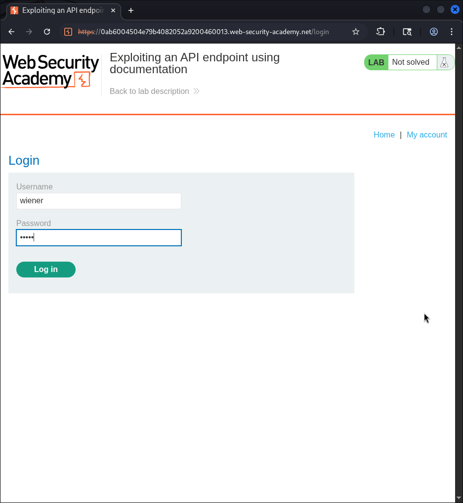
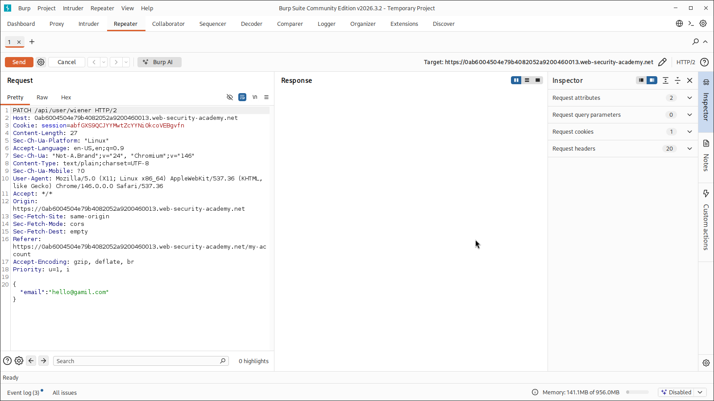
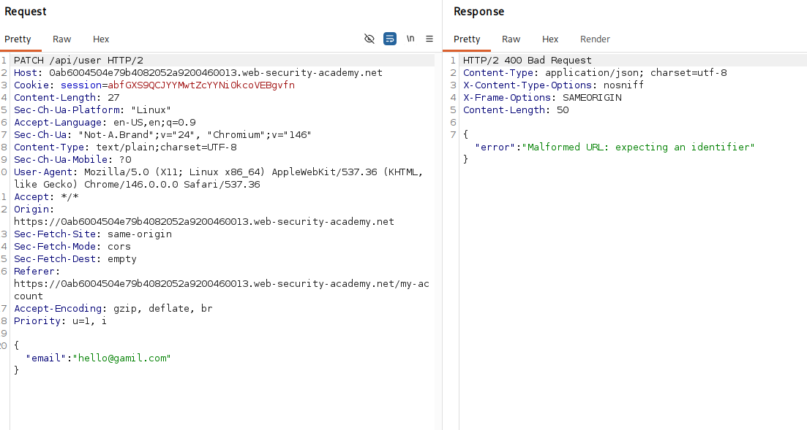
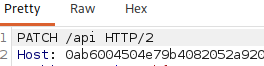
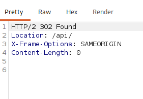
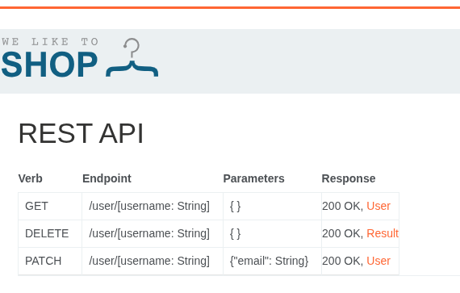
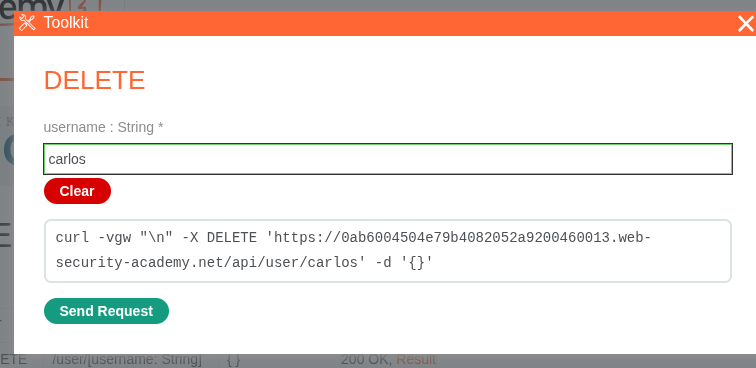

# PortSwigger Web Security Academy Write-up: Exploiting an API Endpoint Using Documentation

## Overview
- **Lab Name:** Exploiting an API endpoint using documentation
- **Category:** API Security / Broken Access Control & Information Disclosure
- **Difficulty:** Practitioner
- **Target:** PortSwigger Web Security Academy Lab Environment

---

## Executive Summary
During API assessments, exposed or publicly accessible API documentation (such as Swagger, OpenAPI, or custom interactive toolkits) can reveal unlinked, sensitive endpoints or administrative functionalities. In this lab, we identified an API endpoint used during account profile updates, discovered exposed interactive API documentation by probing higher-level endpoint directories (`/api/`), identified an unlinked `DELETE` endpoint, and executed an unauthorized request to delete user `carlos` to solve the challenge.

---

## Walkthrough & Proof of Concept (PoC)

### Step 1: Initial Reconnaissance & Login
1. Navigated to the application login page (`/login`) and authenticated using the provided default user credentials:
   - **Username:** `wiener`
   - **Password:** `peter`

2. Navigated to the **My Account** section and attempted to update the email address to `hello@gamil.com`.

### Step 2: Intercepting & Analyzing Traffic in Burp Suite
1. Inspected the HTTP history in **Burp Suite Proxy**.
2. Observed that updating the email issued an asynchronous JSON API request:
   ```http
   PATCH /api/user/wiener HTTP/2
   Host: 0ab6004504e79b4082052a9200460013.web-security-academy.net
   Cookie: session=<SESSION_COOKIE>
   Content-Type: text/plain;charset=UTF-8

   {
     "email": "hello@gamil.com"
   }
   ```
3. The server responded with HTTP `200 OK`:
   ```json
   {
     "username": "wiener",
     "email": "hello@gamil.com"
   }
   ```

### Step 3: API Path Fuzzing & Error Message Probing
1. Sent the `PATCH /api/user/wiener` request to **Burp Repeater**.
2. Removed the username parameter to test route behavior (`PATCH /api/user`). 
3. Received an HTTP `400 Bad Request` with an informative error message:
   ```json
   {
     "error": "Malformed URL: expecting an identifier"
   }
   ```
4. Stripped the path further to test base endpoint discovery (`/api`).

5. The server returned an HTTP `302 Found` redirecting to `/api/`.

### Step 4: Accessing Exposed API Documentation
1. Navigated to `/api/` in the browser / proxy.
2. The endpoint loaded an interactive **REST API Documentation** interface titled *WE LIKE TO SHOP*.
3. The documentation detailed three API operations:
   | Verb | Endpoint | Parameters | Expected Response |
   | :--- | :--- | :--- | :--- |
   | `GET` | `/user/[username: String]` | `{}` | `200 OK, User` |
   | `DELETE` | `/user/[username: String]` | `{}` | `200 OK, Result` |
   | `PATCH` | `/user/[username: String]` | `{"email": String}` | `200 OK, User` |

### Step 5: Exploitation & Account Deletion
1. Located the undocumented `DELETE /user/[username: String]` method within the documentation toolkit.
2. Selected the `DELETE` endpoint and specified `carlos` as the target `username`.
3. Executed the `DELETE` request directly via the toolkit interactive prompt (or curl):
   ```bash
   curl -X DELETE 'https://0ab6004504e79b4082052a9200460013.web-security-academy.net/api/user/carlos'      -H 'Cookie: session=<SESSION_COOKIE>'      -d '{}'
   ```


4. The server processed the deletion without validating whether the requesting user (`wiener`) possessed administrative privileges or authorization to delete `carlos`.
5. Received confirmation banner: **"Congratulations, you solved the lab!"**

---

## Root Cause Analysis
1. **Exposure of Sensitive API Documentation:** Interactive documentation endpoints (`/api/`) were publicly accessible without proper access control or IP restriction in production.
2. **Broken Object Level Authorization (BOLA / IDOR):** The `DELETE /api/user/{username}` endpoint lacked function-level and object-level authorization checks, allowing standard users to invoke privileged user deletion functions on arbitrary targets.

